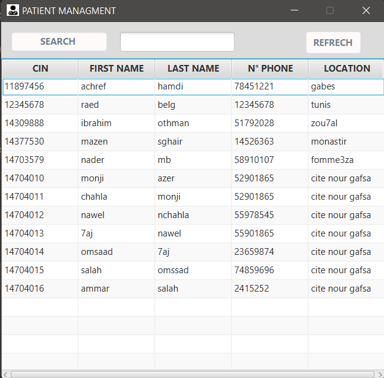

#JavaFx & MySQl Project

This is a simple javaFX project aiming to registrate some local data from "Patients" in a database

#How to use this application

* Install MySQL from this link : https://dev.mysql.com/downloads/installer/

  * Modify the DataBaseConnection Class (put your database name,user and the password)

* Install javafx from this link : https://gluonhq.com/products/javafx/ 

  * Make sure that you had put the javafx libraries on the project structure
  
* Enjoy the Application

* Some application's screenshots

